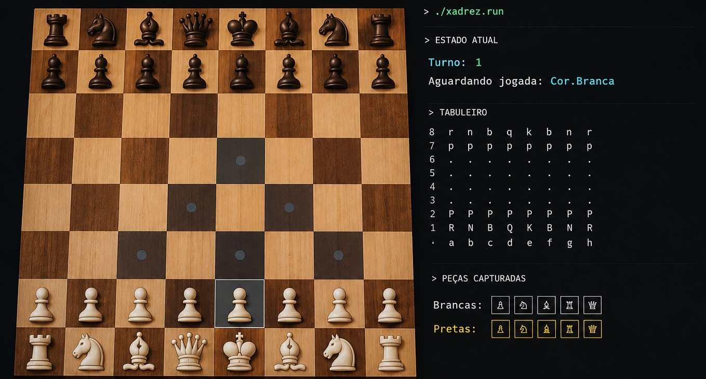

# ♟️ Xadrez Console

Este é um motor de jogo de xadrez completo desenvolvido em **C#** que roda diretamente no terminal. O projeto foi construído aplicando conceitos rigorosos de Programação Orientada a Objetos (POO) para simular todas as regras, movimentos e estados de uma partida real de xadrez.



---

## 🛠️ Regras do Jogo e Funcionamento

O sistema gerencia o ciclo de vida completo de uma partida, garantindo que o jogo siga as normas oficiais do xadrez internacional:

* **Sistema de Turnos:** Controle estrito de alternância entre as peças Brancas e Pretas.
* **Mecânica de Xeque e Xeque-Mate:** Verificação em tempo real (a cada movimento) se o Rei de uma das cores está sob ataque ou se a partida foi finalizada por falta de saídas legais.
* **Controle de Tempo (Timer):** Gerenciamento e exibição do tempo gasto por cada jogador em suas respectivas jogadas.
* **Histórico de Capturas:** Rastreamento dinâmico e exibição de todas as peças eliminadas durante o confronto.

---

## 👑 Comportamento e Movimentação das Peças

Cada peça foi programada como um objeto individual que herda propriedades de uma classe base, mas possui sua própria lógica de matriz para calcular movimentos possíveis:

* **Rei (K):** Move-se apenas 1 casa em qualquer direção. É a peça central para a validação de Xeque.
* **Rainha/Dama (Q):** Movimentação livre em linhas, colunas e diagonais, combinando os poderes da Torre e do Bispo.
* **Torre (R):** Move-se em linha reta pelas colunas e linhas, por quantas casas estiverem livres.
* **Bispo (B):** Movimentação estritamente pelas diagonais do tabuleiro.
* **Cavalo (N):** Movimenta-se em formato de "L" ($2 \times 1$ ou $1 \times 2$), sendo a única peça capaz de pular outras unidades.
* **Peão (P):** Move-se apenas 1 casa para frente (ou 2 no primeiro movimento). Ataca estritamente na diagonal avançada.

### ⚡ Jogadas Especiais Implementadas:
* **Roque (Pequeno e Grande):** Movimento duplo envolvendo o Rei e a Torre sob condições específicas de não-movimentação prévia e ausência de xeque.
* **En Passant:** Captura especial de peão adversário que tenha avançado duas casas no turno anterior.
* **Promoção de Peão:** Substituição automática do Peão por uma peça maior (como a Rainha) ao atingir a última linha inimiga.

---

## 🏗️ Arquitetura do Código

O projeto é dividido em namespaces para garantir a separação de responsabilidades:

* **Camada Tabuleiro (`tabuleiro`):** Controla a estrutura física da matriz $8 \times 8$, validação de limites de posições e posicionamento genérico de peças.
* **Camada Xadrez (`xadrez`):** Contém o motor de regras, propriedades específicas de cada peça e o loop principal da partida (`PartidaDeXadrez.cs`).
* **Camada de Visão (`Tela.cs`):** Responsável por capturar o input do usuário (ex: `a1`, `h8`), traduzir para coordenadas da matriz e renderizar o tabuleiro colorido no terminal.

---

## 💻 Como Executar o Projeto

### Pré-requisitos
* [.NET SDK](https://dotnet.microsoft.com/download) instalado na sua máquina.

### Passo a passo
1. Clone o repositório:
   ```bash
   git clone [https://github.com/fernandesgio/xadrez-console.git](https://github.com/fernandesgio/xadrez-console.git)
